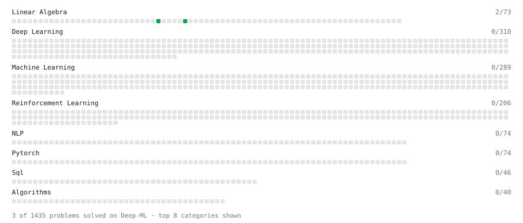

# Deep-ML

My machine learning practice from [Deep-ML](https://www.deep-ml.com). Every solution here was written by hand.

**10** solved · 3 problems · 0 labs · 7 math

[**Browse the interactive portfolio**](https://sriharimysore.github.io/deep-ml/) to replay this filling in over time.

## Problems

| | Difficulty | Solved | |
| --- | --- | --- | --- |
| [Derivative of a Polynomial](https://www.deep-ml.com/problems/116) | easy | 2026-09-22 | [solution](problems/0116-derivative-of-a-polynomial) |
| [Dot Product Calculator](https://www.deep-ml.com/problems/83) | easy | 2026-09-21 | [solution](problems/0083-dot-product-calculator) |
| [Vector Element-wise Sum](https://www.deep-ml.com/problems/121) | easy | 2026-09-21 | [solution](problems/0121-vector-element-wise-sum) |

## Math

| | Difficulty | Solved | |
| --- | --- | --- | --- |
| [Derivatives and Gradients](https://www.deep-ml.com/math-problems/1) | easy | 2026-09-22 | [solution](math/0001-derivatives-and-gradients) |
| [Gradient Descent Updates](https://www.deep-ml.com/math-problems/5) | easy | 2026-09-22 | [solution](math/0005-gradient-descent-updates) |
| [Matrix Basics](https://www.deep-ml.com/math-problems/9) | easy | 2026-09-17 | [solution](math/0009-matrix-basics) |
| [Vector Operations](https://www.deep-ml.com/math-problems/7) | easy | 2026-09-17 | [solution](math/0007-vector-operations) |
| [Backpropagation and the Chain Rule](https://www.deep-ml.com/math-problems/4) | medium | 2026-09-22 | [solution](math/0004-backpropagation-and-the-chain-rule) |
| [Matrix Multiplication](https://www.deep-ml.com/math-problems/10) | medium | 2026-09-21 | [solution](math/0010-matrix-multiplication) |
| [Vector Norms and Linear Independence](https://www.deep-ml.com/math-problems/8) | medium | 2026-09-21 | [solution](math/0008-vector-norms-and-linear-independence) |

---

_This file is regenerated by Deep-ML on every push._
